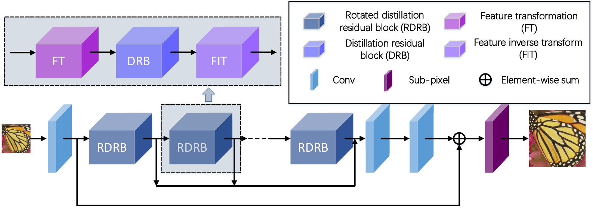

# Lightweight Feature Rotated Distillation Residual Network for  Single Image Super-Resolution
This project is for RDRN introduced in the following paper "Lightweight Feature Rotated Distillation Residual Network for  Single Image Super-Resolution", submitted to IEEE TCSVT.

The code is test on Ubuntu 16.04 environment (Python3.6, PyTorch >= 1.1.0) with Nvidia 1070 Ti GPUs. 
## Contents
1. [Introduction](#introduction)
2. [Test](#test)
3. [Acknowledgements](#acknowledgements)

## Introduction
Deep convolutional neural networks (CNNs) have achieved great success in single image super-resolution (SISR). However, modern state-of-the-art SISR networks often require high computational resources beyond the capabilities of many devices. Therefore, it is valuable to design a lightweight SISR network with excellent reconstruction quality. In this paper, a lightweight feature rotated distillation residual network (RDRN) is proposed for SISR. Our lightweight RDRN is built on  a distillation residual backbone, and the construction of RDRN is considered from both spatial and channel domains. In spatial domains, we propose a feature rotation (FR) strategy to capture geometric self-ensemble information with negligible extra computation and show that the FR strategy can achieve comparable SR performance to the geometric self-ensemble. Furthermore, we propose a lightweight spatial feature extraction block, called small kernel block (SKB), which uses small granularity kernels to reduce computational complexity. In channel domains, we propose an efficient attention mechanism contrast-aware efficient channel attention (CECA), which can improve SR performance with low computational complexity by providing a local cross-channel interaction without dimensionality reduction. Experimental results demonstrate that the proposed RDRN can achieve state-of-the-art results for lightweight SISR in terms of both restoration quality and model complexity.

Lightweight feature rotated distillation residual network (RDRN).
## Test
### Quick start
1. Our Trained RDRN models are located at './checkpoints'.
2. The test data Set5 is stored in './Test_Datasets'.
3. Run 'main_test_RDRN.py' script to generate SR results.
4. Run 'Evaluate_PSNR_SSIM.m' script to evaluate psnr and ssim. (matlab R2018b)

## Acknowledgements
This code is built on [EDSR (PyTorch)](https://github.com/thstkdgus35/EDSR-PyTorch). We thank the authors for sharing their codes.
